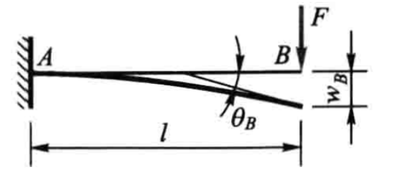
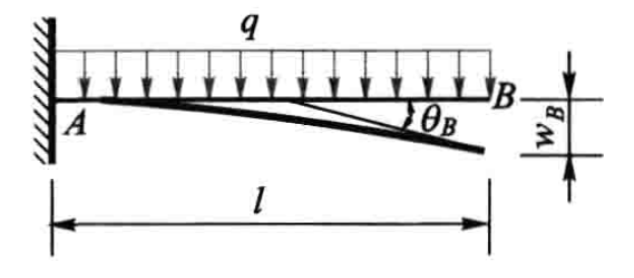
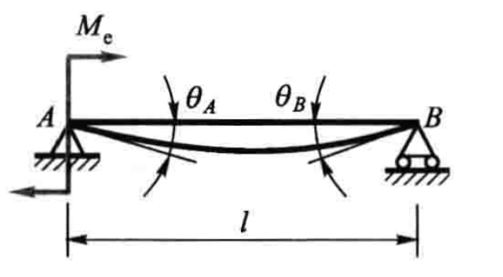
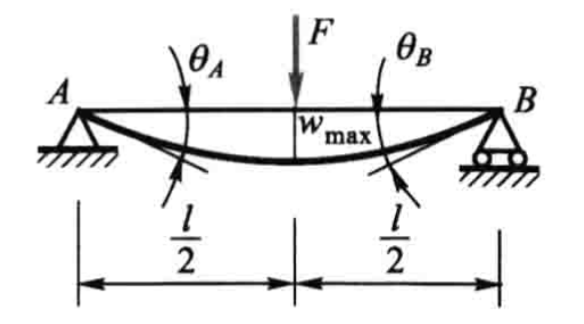
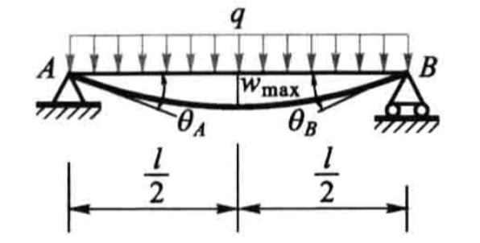

## 材料力学 第六章 - 弯曲变形

### 挠度、转角、力矩、剪力、均布载荷之间关系
$$
w=w(x)
$$
$$
\theta=\frac{\mathrm{d}w}{\mathrm{d}x}
$$
$$

M = EI\frac{\mathrm{d}^2w}{\mathrm{d}x^2}

$$
$$
F_S(x) = \frac{dM(x)}{dx} \quad \text{（剪力与弯矩的关系）}
$$
$$

q(x) = \frac{dF_S(x)}{dx} \quad \text{（载荷与剪力的关系）}

$$

## 证明过程
挠曲线方程：$w=w(x)$
截面转角 $\theta$ 就是y轴与挠曲线法线的夹角。它应等于挠曲线的倾角，即等于 x轴与挠曲线切线的夹角。故有：
$\tan\theta=\frac{\mathrm{d}w}{\mathrm{d}x}$
$\theta=\arctan\biggl(\frac{\mathrm{d}w}{\mathrm{d}x}\biggr)$
$\frac1\rho=\frac M{EI}$
$\left|\frac{\mathrm{d}\theta}{\mathrm{d}s}\right|=\frac M{EI}$

#### 挠曲线的微分方程

这就是挠曲线的微分方程，适用于弯曲变形的任意情况，它是非线性的。

$$

\frac{\frac{\mathrm{d}^2w}{\mathrm{d}x^2}}{\left[\:1+\left(\frac{\mathrm{d}w}{\mathrm{d}x}\right)^2\right]^{3/2}}=\frac M{EI}

$$
在小变形的情况下，可将方程式线性化：
$\theta\approx\tan\:\theta=\frac{\mathrm{d}w}{\mathrm{d}x}=w^{\prime}(\:x\:)$
$$
\frac{\mathrm{d}^2w}{\mathrm{d}x^2}=\frac M{EI}
$$
  
### 剪力和弯矩之间的关系
设梁的轴线为 $x$ 轴，分布载荷集度为 $q(x)$，剪力为 $F_S(x)$，弯矩为 $M(x)$，则三者满足以下微分关系：
$$
\frac{dF_S(x)}{dx} = q(x) \quad \text{（载荷与剪力的关系）}
$$

$$
\frac{dM(x)}{dx} = F_S(x) \quad \text{（剪力与弯矩的关系）}
$$
联立两式可得：

$$

\frac{d^2M(x)}{dx^2} = q(x) \quad \text{（载荷与弯矩的二阶微分关系）}

$$

**对均布载荷的特殊情况**：当 $q(x) = q$（常数）时，上述关系简化为：

- 剪力方程：$F_S(x) = qx + C_1$      （$C_1$ 为积分常数，由边界条件确定）

- 弯矩方程：$M(x) = \frac{1}{2}qx^2 + C_1x + C_2$（$C_2$ 为另一积分常数）

## 讨论几种特殊情况进行分析

> [!info] 情况说明
> 下面讨论的都是在杆上挠度、转角、力矩、集中力是连续的

###  1. 悬臂梁 - 端点受垂直载荷影响 

#### 公式推导过程

$$
M=-F(\:l-x\:)
$$

$$
EIw''=M=-F(\:l-x\:)
$$

$$
EIw=\frac{F}{6}x^3-\frac{Fl}{2}x^2+Cx+D
$$
在固定端A,转角$\theta$和挠度 $w$ 均应等于零

$$
EIw^{\prime}=\frac F2x^2-Flx
$$

$$
EIw=\frac F6x^3-\frac{Fl}2x^2
$$
###  2. 悬臂梁 - 端点受弯矩影响 

#### 公式推导过程

$$
EIw''=-M
$$

$$
EIw'=-Mx+C
$$

$$
EIw=-\frac{M}{2}x^2+Cx+D
$$
在固定端A,转角$\theta$和挠度 $w$ 均应等于零

$$
EIw=-\frac{M}{2}x^2
$$
###  3. 悬臂梁 - 受杆上均布载荷影响 

#### 公式推导过程  

$$
EIw''''=-q
$$  
$$
EIw'''=-qx+C
$$

$$
EIw''=-\frac{q}{2}x^2+Cx+D
$$
 
$$
EIw'=-\frac{q}{6}x^3+\frac{C}{2}x^2+Dx+E
$$
 
$$

EIw=-\frac{q}{24}x^4+\frac{C}{6}x^3+\frac{D}{2}x^2+Ex+F

$$  
在固定端A,转角$ \theta $和挠度 $ w $ 均应等于零 ——> $ E = F = 0 $
$$
EI0=-\frac{q}{24}0^4+\frac{C}{6}0^3+\frac{D}{2}0^2+E0+F
$$

$$

EI0=-\frac{q}{6}0^3+\frac{C}{2}0^2+0x+E

$$

$$

EIw=-\frac{q}{24}x^4+\frac{C}{6}x^3+\frac{D}{2}x^2
$$

在右端点处的自由端的切应力和力矩为0，那么 $ x = l $ 处，挠度的三次和二次偏导数为0

$$
EIw'''=-qx+C
$$

$$
EIw''=-\frac{q}{2}x^2+Cx+D
$$

$C = ql$
$D = -\frac{q}{2}l^2$
 控制方程为：

$$
EIw=-\frac{q}{24}x^4+\frac{ql}{6}x^3-\frac{ql^2}{4}x^2
$$

$$
EIw'=-\frac{q}{6}x^3+\frac{ql}{2}x^2-\frac{ql^2}{2}x
$$

$$
EIw''=-\frac{q}{2}x^2+qlx-\frac{ql^2}{2}
$$

$$
EIw'''=-qx+ql
$$

$$
EIw''''=-q
$$

###  4. 固定铰支/可动铰支 固定端受弯矩影响 

###  6. 固定铰支/可动铰支 中点受集中力影响 

###  7. 固定铰支/可动铰支 受均布载荷影响 

###  8. 固定铰支/可动铰支 中点受集中力影响 

